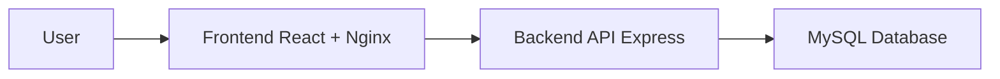

# Student Attendance System

Hệ thống quản lý điểm danh sinh viên theo ngày, xây dựng theo yêu cầu DevOps: React frontend, Express backend API, MySQL database, Docker Compose, GitHub Actions CI, cấu hình bằng ENV và tài liệu deploy/debug.

## Chức Năng

- Đăng nhập và phân quyền `admin`, `teacher`, `student`.
- Admin quản lý sinh viên và danh mục lớp.
- Giảng viên chọn lớp, import file danh sách sinh viên cho lớp đang chọn và điểm danh.
- Sinh viên xem lịch sử điểm danh cá nhân.
- Điểm danh theo ngày với 4 trạng thái: `Có mặt`, `Vắng`, `Đi trễ`, `Có phép`.
- Mỗi sinh viên chỉ có một bản ghi điểm danh trong một ngày; lưu lại sẽ cập nhật.
- Xác nhận và khóa điểm danh theo lớp/ngày để tránh sửa tùy tiện sau khi chốt.
- Lọc danh sách điểm danh theo ngày, lớp, MSSV, trạng thái.
- Thống kê chuyên cần: tổng buổi, có mặt, vắng, đi trễ, có phép, tỷ lệ chuyên cần.
- Xuất báo cáo CSV.

## Tài Khoản Demo

| Username | Password | Role |
| --- | --- | --- |
| admin | Admin@123 | Quản trị hệ thống |
| teacher | Teacher@123 | Giảng viên |
| student | Student@123 | Sinh viên demo |

## Cấu Trúc Thư Mục

```text
.
├── .github/workflows/ci.yml
├── backend/
│   ├── src/
│   ├── tests/
│   ├── Dockerfile
│   └── package.json
├── frontend/
│   ├── src/
│   │   ├── api/
│   │   ├── components/
│   │   ├── constants/
│   │   ├── features/
│   │   └── utils/
│   ├── Dockerfile
│   └── package.json
├── docs/
│   └── import-samples/
├── scripts/
├── docker-compose.yml
├── .env.example
└── README.md
```

Các thư mục generated như `node_modules`, `dist`, `__pycache__` không nằm trong source và đã được đưa vào `.gitignore`.

## Kiến Trúc



Docker Compose chạy 3 service:

- `frontend`: React build multi-stage, serve bằng Nginx.
- `backend`: Express API.
- `mysql`: MySQL 8.4, lưu dữ liệu hệ thống.

## Database

- `users`: tài khoản đăng nhập và vai trò.
- `classes`: danh mục lớp.
- `students`: thông tin sinh viên, gắn với lớp qua `class_name`.
- `attendance`: dữ liệu điểm danh, có `marked_by_user_id`.
- `attendance_locks`: trạng thái khóa điểm danh theo lớp/ngày.

## Chạy Bằng Docker

Tạo ENV từ file mẫu:

```powershell
Copy-Item .env.example .env
```

Chạy toàn bộ hệ thống:

```powershell
docker compose up -d --build
```

URL demo:

- Frontend: http://localhost:8080
- Backend health: http://localhost:4000/api/health
- MySQL host port: `3307`

Kiểm tra container và log:

```powershell
docker compose ps
docker compose logs backend --tail 100
docker compose logs mysql --tail 100
```

Smoke test:

```powershell
powershell -ExecutionPolicy Bypass -File .\scripts\smoke-test.ps1
```

## Import Danh Sách Theo Lớp

File mẫu nằm trong `docs/import-samples/`.

Luồng chuẩn:

1. Admin tạo lớp trong tab `Lớp` nếu lớp chưa tồn tại.
2. Admin hoặc giảng viên chọn lớp.
3. Import file Excel/CSV danh sách sinh viên.
4. Backend gán toàn bộ sinh viên trong file vào lớp đang chọn, không cộng dồn nhầm sang lớp khác.

Các cột hỗ trợ: `MSSV`, `Họ tên`, `Lớp`. Khi import từ UI, lớp trong file có thể bị ghi đè bằng lớp đang chọn để bảo đảm mỗi file thuộc đúng một lớp.

## API Chính

- `GET /api/health`
- `POST /api/auth/login`
- `POST /api/auth/logout`
- `GET /api/classes`
- `POST /api/classes`
- `PUT /api/classes/:id`
- `DELETE /api/classes/:id`
- `GET /api/students?className=D21CQCN01`
- `POST /api/students`
- `PUT /api/students/:id`
- `DELETE /api/students/:id`
- `POST /api/students/import`
- `GET /api/attendance?date=YYYY-MM-DD&className=D21CQCN01`
- `POST /api/attendance`
- `POST /api/attendance/lock`
- `GET /api/stats?from=YYYY-MM-DD&to=YYYY-MM-DD&className=D21CQCN01`
- `GET /api/reports/attendance.csv`

## CI/CD

GitHub Actions chạy khi `push` hoặc `pull_request` vào `main` và `dev`:

- Backend: install dependency, lint, test, build.
- Frontend: install dependency, lint, test, build.
- Docker: `docker compose config`, `docker compose build`.

## Branching

- `main`: production-ready.
- `dev`: tích hợp tính năng trước khi merge main.
- `feature/*`: phát triển từng chức năng.

## Tài Liệu

- [Architecture](docs/architecture.md)
- [Deployment](docs/deployment.md)
- [Debugging and incidents](docs/debugging-incidents.md)

## Contributors

- [dpt004](https://github.com/dpt004) — Lead DevOps Engineer & Main Contributor
