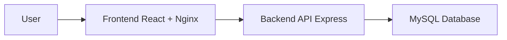

# Student Attendance System

Hệ thống quản lý điểm danh sinh viên theo ngày. Dự án được thiết kế theo yêu cầu DevOps: có frontend React, backend API, MySQL database, Docker Compose, GitHub Actions CI và tài liệu deploy/debug.

## Chức năng

- Import danh sách sinh viên từ file Excel (`.xlsx`, `.xls`, `.csv`)
- Quản lý danh sách sinh viên
- Đăng nhập và phân quyền `admin` / `teacher`
- Điểm danh sinh viên theo ngày với 2 lựa chọn tích một trong hai: `Có mặt` hoặc `Vắng`
- Xem lại danh sách điểm danh theo ngày
- Thống kê số buổi có mặt theo từng sinh viên

## Module chức năng

- Authentication: đăng nhập, đăng xuất, phân quyền theo vai trò.
- Student Management: thêm/sửa/xóa sinh viên, import Excel, quản lý danh sách sinh viên và lớp.
- Attendance: điểm danh theo ngày bằng hai ô tích loại trừ nhau, cập nhật điểm danh, xem lịch sử theo ngày.
- Report: thống kê chuyên cần và nền tảng để mở rộng xuất Excel/PDF.

Phiên bản hiện tại tập trung vào mức tối thiểu của đồ án sinh viên: đăng nhập, phân quyền, CRUD sinh viên, import Excel, điểm danh theo ngày, xem danh sách điểm danh, thống kê số buổi có mặt, Docker, MySQL và CI.

## Kiến trúc



Services trong Docker Compose:

- `frontend`: React build multi-stage, chạy bằng Nginx
- `backend`: Express API
- `mysql`: MySQL 8.4, lưu bảng `students` và `attendance`

## Bảng dữ liệu

`students`

| Field | Meaning |
| --- | --- |
| id | Mã sinh viên nội bộ |
| student_code | Mã số sinh viên |
| full_name | Họ tên sinh viên |
| class_name | Lớp |
| created_at | Ngày tạo |

`attendance`

| Field | Meaning |
| --- | --- |
| id | Mã điểm danh |
| student_id | Mã sinh viên |
| attendance_date | Ngày điểm danh |
| status | `present` hoặc `absent` |
| created_at | Thời gian ghi nhận |

## Chạy bằng Docker

Tạo file `.env` từ mẫu nếu cần đổi cấu hình:

```powershell
Copy-Item .env.example .env
```

Chạy toàn bộ hệ thống:

```powershell
docker compose up -d --build
```

URL demo:

- Frontend: http://localhost:8080
- Backend health: http://localhost:4000/api/health
- MySQL host port: `3307`

Tài khoản demo:

| Username | Password | Role |
| --- | --- | --- |
| admin | Admin@123 | Quản trị, được thêm/sửa/xóa/import sinh viên |
| teacher | Teacher@123 | Giảng viên, được điểm danh và xem báo cáo |

Kiểm tra container và log:

```powershell
docker compose ps
docker compose logs backend --tail 100
docker compose logs mysql --tail 100
```

Smoke test:

```powershell
powershell -ExecutionPolicy Bypass -File .\scripts\smoke-test.ps1
```

Tắt hệ thống:

```powershell
docker compose down
```

## Excel Import

Sheet đầu tiên cần có các cột:

| MSSV | Họ tên | Lớp |
| --- | --- | --- |
| SV001 | Nguyen Van An | D21CQCN01 |

Backend cũng chấp nhận các tên cột gần tương đương như `student_code`, `full_name`, `class_name`, `Mã sinh viên`, `Ho ten`, `Lop`.

Các file mẫu theo lớp nằm trong `docs/import-samples/`.

## API Chính

- `GET /api/health`
- `POST /api/auth/login`
- `POST /api/auth/logout`
- `GET /api/students`
- `POST /api/students`
- `PUT /api/students/:id`
- `DELETE /api/students/:id`
- `POST /api/students/import`
- `GET /api/attendance?date=YYYY-MM-DD`
- `POST /api/attendance`
- `GET /api/stats?from=YYYY-MM-DD&to=YYYY-MM-DD`

## CI/CD

GitHub Actions chạy khi `push` hoặc `pull_request` vào `main` và `dev`:

- Backend: `npm install`, lint, test, build
- Frontend: `npm install`, lint, test, build
- Docker: `docker compose config`, `docker compose build`

## Branching

Quy ước bắt buộc:

- `main`: production-ready
- `dev`: tích hợp tính năng trước khi merge main
- `feature/*`: phát triển từng chức năng

## Tài liệu DevOps

- [Architecture](docs/architecture.md)
- [Deployment](docs/deployment.md)
- [Debugging and incidents](docs/debugging-incidents.md)
