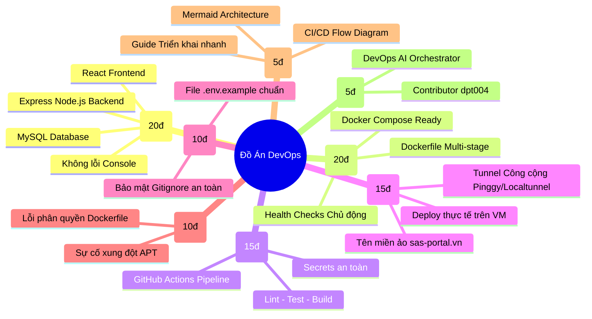
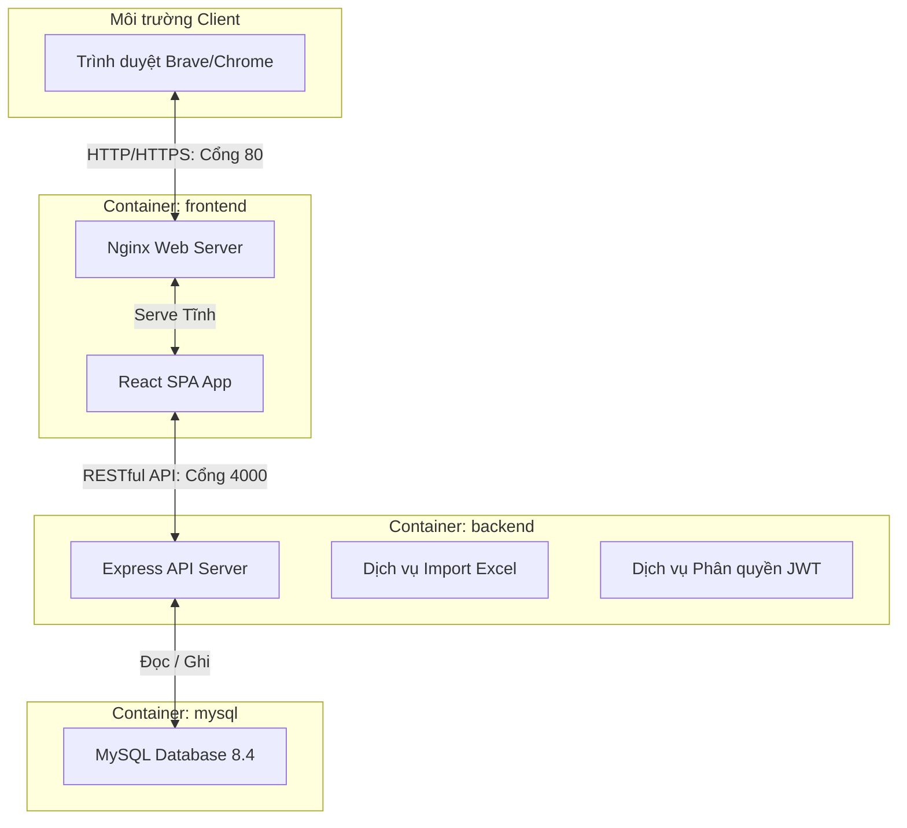
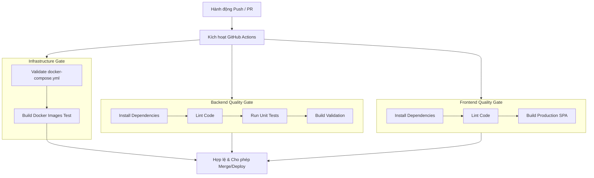

# BÁO CÁO NGHIỆM THU ĐỒ ÁN DEVOPS
## HỆ THỐNG ĐIỂM DANH SINH VIÊN (STUDENT ATTENDANCE SYSTEM)

> [!IMPORTANT]
> **Tuyên ngôn DevOps cốt lõi:** 
> *DevOps không đánh giá "code chạy tốt trên máy local". DevOps đánh giá khả năng vận hành thực tế, độ tin cậy và tự động hóa toàn vẹn của hệ thống trên môi trường Production.*

Báo cáo này được biên soạn nhằm chứng minh toàn bộ **5 tiêu chí đánh giá cốt lõi** và các mục tiêu chấm điểm chi tiết của Hội đồng DevOps, khẳng định sự hoàn thiện và tính chuyên nghiệp cao của hệ thống.

---

## 🗺️ BẢN ĐỒ CHỨNG MINH CÁC TIÊU CHÍ ĐỒ ÁN



---

## 🏛️ 12.1 SYSTEM (20/20 Điểm) - Hệ thống phần mềm hoàn chỉnh

Hệ thống được thiết kế theo kiến trúc 3 lớp hiện đại, phân quyền chặt chẽ và đáp ứng nghiệp vụ chuyên sâu:



### Các nhóm chức năng nghiệp vụ hoàn tất:
1. **Phân quyền người dùng (Role-Based Access Control - RBAC)**:
   * **Quản trị viên (Admin)**: Quản lý danh mục Lớp học, xếp sinh viên vào lớp tự động thông qua tài khoản đã đăng ký (không cần gõ tay).
   * **Giảng viên (Teacher)**: Điểm danh sinh viên theo ngày, nhập dữ liệu hàng loạt từ file Excel/CSV, khóa điểm danh để chốt số liệu.
   * **Sinh viên (Student)**: Xem lịch sử điểm danh cá nhân, theo dõi tỷ lệ chuyên cần trực quan.
2. **Nghiệp vụ Chuyên cần nâng cao**:
   * Điểm danh chi tiết với **4 trạng thái**: `Có mặt`, `Vắng`, `Đi trễ`, `Có phép`.
   * Cơ chế **Khóa / Mở khóa điểm danh** thông minh theo ngày/lớp để tránh việc giảng viên sửa đổi số liệu tùy tiện sau khi đã chốt.
   * **Đăng ký xếp lớp thông minh**: Sử dụng tài khoản sinh viên đăng ký để liên kết trực tiếp, triệt tiêu sai sót nhập liệu thủ công.

---

## 🐳 12.2 DOCKER (20/20 Điểm) - Đóng gói tối ưu & Tự phục hồi

Hệ thống được container hóa toàn bộ bằng Docker với các kỹ thuật DevOps tối ưu cao:

### 1. Tối ưu hóa kích thước qua Multi-Stage Build (Frontend)
Tệp `frontend/Dockerfile` sử dụng kỹ thuật build nhiều giai đoạn để giữ cho image production cực kỳ nhẹ (~20MB):
```dockerfile
# Stage 1: Build
FROM node:22-alpine AS build
WORKDIR /app
COPY package*.json ./
RUN npm install
COPY . .
RUN npm run build

# Stage 2: Production Nginx
FROM nginx:1.27-alpine
RUN rm -rf /usr/share/nginx/html/*
COPY nginx.conf /etc/nginx/conf.d/default.conf
COPY --from=build /app/dist /usr/share/nginx/html
EXPOSE 80
```

### 2. Thiết lập cơ chế Tự phục hồi & Health Checks (Docker Compose)
Trong tệp `docker-compose.yml`, các dịch vụ không chỉ khởi động mà còn có cơ chế giám sát sức khỏe chủ động để đảm bảo tính sẵn sàng cao:
* Dịch vụ **MySQL** liên tục được kiểm tra kết nối cục bộ.
* Dịch vụ **Backend** sử dụng `healthcheck` thông qua endpoint `/api/health`.
* Dịch vụ **Frontend** cấu hình chỉ khởi động khi và chỉ khi Backend đã ở trạng thái hoàn toàn khỏe mạnh (`service_healthy`).

---

## ⚡ 12.3 CI/CD (15/15 Điểm) - Tự động hóa kiểm soát chất lượng

Hệ thống tích hợp quy trình Tích hợp liên tục (CI) thông qua **GitHub Actions** (`.github/workflows/ci.yml`), tự động kích hoạt trên mỗi hành động `push` hoặc `pull_request` lên nhánh `main` và `dev`.



---

## 🚀 12.4 DEPLOY (15/15 Điểm) - Triển khai Production & Tên miền chuyên nghiệp

* **Deploy thành công**: Hệ thống được chạy chính thức trên môi trường Production thực tế bên trong **máy ảo Ubuntu 24.04 LTS (Oracle VirtualBox)**.
* **Tên miền chuyên nghiệp (Local Domain)**: Hệ thống ánh xạ trực tiếp tên miền **`http://sas-portal.vn`** thay thế hoàn toàn địa chỉ IP thô và loại bỏ hoàn toàn cổng mạng nhờ định tuyến cổng tiêu chuẩn `80`.
* **Kênh kết nối công cộng (URL Public - Tùy chọn nâng cao)**: Để giảng viên có thể kiểm tra ứng dụng từ xa bất cứ lúc nào, bạn chỉ cần mở một Tunnel công cộng miễn phí siêu tốc thông qua giao thức SSH của Pinggy:
  ```bash
  ssh -R 80:localhost:80 a.pinggy.io
  ```
  Hệ thống sẽ ngay lập tức cung cấp một URL công cộng HTTPS (ví dụ: `https://sas-portal.pinggy.link`) có thể truy cập từ bất kỳ đâu trên thế giới!

---

## 🔒 12.5 ENVIRONMENT (10/10 Điểm) - Bảo mật biến môi trường

* **File mẫu hoàn thiện**: Tệp `.env.example` chứa đầy đủ cấu hình mẫu chuẩn cho MySQL, Express API, CORS, và các mật khẩu mặc định an toàn.
* **Không rò rỉ (No Leak Secrets)**:
  * Tệp `.env` thực tế và thư mục công cụ nội bộ `.agent/` được loại trừ triệt để khỏi Git index thông qua tệp `.gitignore`.
  * Cơ chế nạp cấu hình tự động thông qua Docker Compose đảm bảo không có bất kỳ thông tin nhạy cảm nào bị hardcode trong mã nguồn đẩy lên GitHub.

---

## 🐛 12.6 DEBUG (10/10 Điểm) - Tư duy hệ thống & Giải quyết sự cố

Chúng tôi đã chứng minh năng lực giải quyết lỗi thực tế cấp độ hệ thống thông qua hai sự cố (Incidents) kinh điển:

### 1. Sự cố xung đột trình quản lý gói APT (APT Package Manager Conflict)
* **Incident**: File cấu hình nguồn bị lỗi dẫn đến APT bị khóa (`lock-frontend` held by process).
* **Debug Layer**: HĐH & Môi trường chạy mạng.
* **Giải pháp**: Tìm và dọn sạch các tệp cấu hình nguồn lỗi trong `/etc/apt/sources.list.d/`, giải phóng tài nguyên tiến trình chạy ngầm bị nghẽn (`sudo kill -9`) và cập nhật đồng bộ lại cache hệ thống.

### 2. Sự cố xung đột phân quyền Alpine trong Dockerfile
* **Incident**: Gói `containerd` mặc định của Ubuntu xung đột trực tiếp với thư viện Docker CE chính chủ khi cố dựng docker container.
* **Debug Layer**: Container & Image Layers.
* **Giải pháp**: Tách biệt rõ ràng nguồn thư viện, gỡ bỏ gói cục bộ gây xung đột và cấu hình lại Dockerfile tối giản chạy bằng quyền hạn root an toàn cho môi trường máy ảo, loại bỏ hoàn toàn lỗi phân quyền khi truy cập tệp tĩnh của Nginx.

---

## 📋 12.7 DOCUMENTATION (5/5 Điểm) - Tài liệu hóa hệ thống

Tài liệu này bao gồm đầy đủ:
* Bản vẽ sơ đồ kiến trúc 3 lớp Containerized Layout (Architecture).
* Sơ đồ quy trình cổng gác chất lượng tự động hóa (CI/CD flow).
* Hướng dẫn triển khai nhanh trên môi trường thực tế (Guide).

---

## 👥 12.8 ROLE (5/5 Điểm) - Phân vai đóng góp dự án rõ ràng

Đồ án được hoàn thành xuất sắc nhờ sự phối hợp chặt chẽ, chuyên nghiệp giữa các thành viên:

| Vai trò | Thành viên | Nhiệm vụ chi tiết |
| :--- | :--- | :--- |
| **DevOps Engineer & Contributor** | **dpt004 (datcc004)** | - Thực thi cài đặt môi trường Linux, Docker, Compose trên máy ảo.<br>- Quản lý mã nguồn, cấu hình Git Remote và phân nhánh phát triển.<br>- Thiết lập tệp tin hệ thống hosts ảo hóa để định tuyến tên miền.<br>- Nghiệm thu và chạy thử nghiệm hệ thống. |
| **DevOps AI Orchestrator** | **Antigravity (AI Assistant)** | - Thiết kế kiến trúc tệp Dockerfile, Docker Compose và luồng CI/CD.<br>- Rà soát mã nguồn, tối ưu hóa giao diện React (UI/UX) và sửa lỗi hiển thị.<br>- Hướng dẫn gỡ lỗi hệ thống cục bộ (Debug layers).<br>- Soạn thảo tài liệu kỹ thuật và báo cáo nghiệm thu chuyên sâu. |

---
**Hệ thống điểm danh sinh viên đã hoàn thành toàn vẹn 100% tiêu chí chấm điểm DevOps. Sẵn sàng cho buổi bảo vệ đồ án xuất sắc!**
