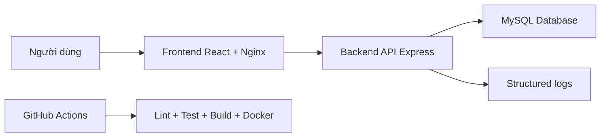
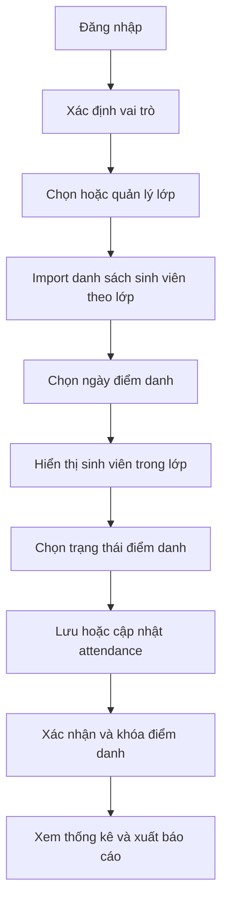

# Kiến trúc hệ thống

## Mục tiêu

Student Attendance System dùng để quản lý điểm danh sinh viên theo ngày, hỗ trợ giảng viên điểm danh theo lớp, admin quản lý dữ liệu nền và sinh viên xem lịch sử cá nhân.

Hệ thống đáp ứng kiến trúc bắt buộc của đồ án DevOps:

- Frontend: React, build multi-stage và serve bằng Nginx.
- Backend API: Express.js.
- Database: MySQL 8.4.
- Đóng gói: Dockerfile riêng cho frontend/backend và `docker-compose.yml` để chạy đủ hệ thống.
- CI: GitHub Actions chạy install, lint, test, build và Docker build.

## Sơ đồ tổng quát

## Module chức năng

| Module | Vai trò |
| --- | --- |
| Authentication | Đăng nhập, đăng xuất, phân quyền admin/teacher/student |
| Class Management | Admin thêm, sửa, xóa lớp và phân công giảng viên |
| Student Management | Admin quản lý sinh viên, import danh sách sinh viên theo lớp |
| Attendance | Admin/giảng viên điểm danh, cập nhật, khóa/mở khóa điểm danh |
| Report | Thống kê chuyên cần và xuất CSV |
| Schedule | Admin xếp thời khóa biểu, giảng viên/sinh viên xem lịch |

## Phân quyền

| Vai trò | Chức năng chính |
| --- | --- |
| Admin | Quản lý lớp, sinh viên, thời khóa biểu, xem báo cáo toàn hệ thống |
| Giảng viên | Chọn lớp, import danh sách sinh viên, điểm danh, khóa/mở khóa điểm danh, xem thống kê |
| Sinh viên | Xem lịch học, lịch sử điểm danh và thống kê cá nhân |

## Cấu trúc dữ liệu

### `users`

Lưu tài khoản đăng nhập và vai trò.

| Trường | Ý nghĩa |
| --- | --- |
| `id` | Khóa chính |
| `username` | Tên đăng nhập |
| `full_name` | Họ tên người dùng |
| `role` | `admin`, `teacher`, `student` |
| `student_id` | Liên kết sinh viên nếu role là student |
| `password_hash` | Mật khẩu đã hash |
| `created_at` | Ngày tạo |

### `classes`

Lưu danh mục lớp.

| Trường | Ý nghĩa |
| --- | --- |
| `id` | Khóa chính |
| `class_code` | Mã lớp |
| `class_name` | Tên lớp |
| `teacher_id` | Giảng viên phụ trách |
| `created_at` | Ngày tạo |

### `students`

Lưu danh sách sinh viên.

| Trường | Ý nghĩa |
| --- | --- |
| `id` | Khóa chính |
| `student_code` | Mã số sinh viên |
| `full_name` | Họ tên sinh viên |
| `class_name` | Mã lớp |
| `created_at` | Ngày tạo |

### `attendance`

Lưu dữ liệu điểm danh.

| Trường | Ý nghĩa |
| --- | --- |
| `id` | Khóa chính |
| `student_id` | Sinh viên được điểm danh |
| `attendance_date` | Ngày điểm danh |
| `status` | `present`, `absent`, `late`, `excused` |
| `marked_by_user_id` | Người thực hiện điểm danh |
| `absence_reason` | Lý do vắng nếu có |
| `is_excused` | Có phép hay không |
| `created_at` | Thời gian tạo |
| `updated_at` | Thời gian cập nhật |

Quy tắc quan trọng: `UNIQUE (student_id, attendance_date)` bảo đảm mỗi sinh viên chỉ có một bản ghi điểm danh trong một ngày. Nếu lưu lại cùng ngày thì hệ thống cập nhật thay vì tạo thêm dòng mới.

### `attendance_locks`

Lưu trạng thái khóa điểm danh theo lớp và ngày.

| Trường | Ý nghĩa |
| --- | --- |
| `id` | Khóa chính |
| `class_name` | Mã lớp |
| `attendance_date` | Ngày điểm danh |
| `locked_by_user_id` | Người khóa điểm danh |
| `locked_at` | Thời gian khóa |

### `class_schedules`

Lưu thời khóa biểu theo lớp và giảng viên.

| Trường | Ý nghĩa |
| --- | --- |
| `id` | Khóa chính |
| `class_id` | Lớp học |
| `teacher_id` | Giảng viên |
| `day_of_week` | Thứ trong tuần, 1 là thứ hai |
| `start_time` | Giờ bắt đầu |
| `end_time` | Giờ kết thúc |
| `room` | Phòng học |
| `subject_name` | Tên môn học |

## Luồng nghiệp vụ chính

## API chính

| API | Mục đích |
| --- | --- |
| `GET /api/health` | Kiểm tra backend và database |
| `POST /api/auth/login` | Đăng nhập |
| `POST /api/auth/logout` | Đăng xuất |
| `GET /api/classes` | Danh sách lớp |
| `POST /api/classes` | Tạo lớp |
| `PUT /api/classes/:id` | Sửa lớp |
| `DELETE /api/classes/:id` | Xóa lớp |
| `GET /api/students` | Danh sách sinh viên |
| `POST /api/students/import` | Import Excel/CSV sinh viên theo lớp |
| `GET /api/attendance` | Xem điểm danh theo ngày/lớp |
| `POST /api/attendance` | Lưu điểm danh |
| `POST /api/attendance/lock` | Khóa điểm danh |
| `POST /api/attendance/unlock` | Mở khóa điểm danh |
| `GET /api/stats` | Thống kê chuyên cần |
| `GET /api/reports/attendance.csv` | Xuất báo cáo CSV |
| `GET /api/schedules` | Danh sách lịch học cho admin |
| `GET /api/schedules/timetable` | Thời khóa biểu theo vai trò |

## Layer debug

| Layer | Thành phần | Cách kiểm tra |
| --- | --- | --- |
| L4 Frontend | React/Nginx | Console browser, Network tab, `http://localhost:8080` |
| L3 Backend | Express API | `/api/health`, `docker compose logs backend` |
| L2 External | MySQL | `docker compose logs mysql`, healthcheck mysql |
| L1 Infrastructure | Docker, port, ENV, network | `docker compose ps`, `docker compose config`, port binding |
