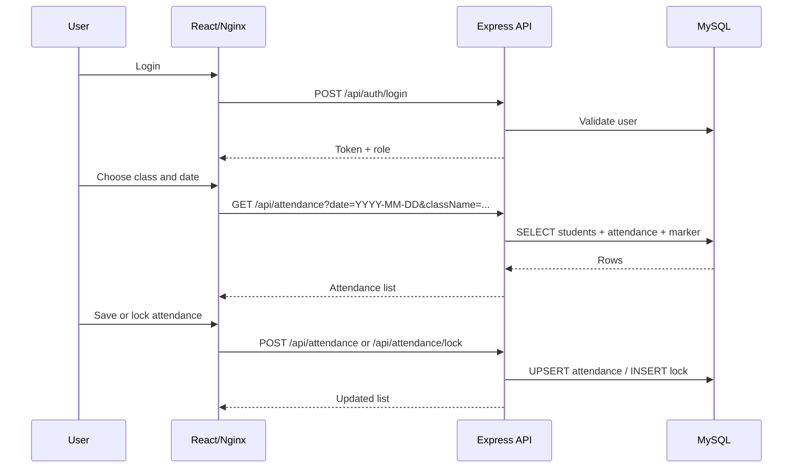

# Architecture

## Runtime Flow

## Modules

- Authentication: login, logout, role-based access.
- Class Management: admin creates, edits, deletes classes.
- Student Management: admin manages students; admin/teacher imports one file into the selected class.
- Attendance: teacher/admin marks daily attendance, edits before lock, locks class/day after confirmation.
- Report: class/student/date filters, attendance statistics, CSV export.

## Business Rules

- A user must login before using protected APIs.
- Student role can only view its own attendance and statistics.
- A student must belong to the selected class before attendance can be saved.
- One student has only one attendance row per date.
- Saving the same student/date updates the existing row.
- Attendance status is limited to `present`, `absent`, `late`, `excused`.
- A locked class/date cannot be edited again through the attendance API.
- Statistics count all attendance rows as total sessions and use `present / total * 100` for attendance rate.
- Import from UI forces all rows in one file into the selected class to avoid mixing classes.

## Deployment Units

- Frontend image is built with a multi-stage Dockerfile.
- Backend image installs production dependencies only.
- MySQL data is stored in the `mysql_data` Docker volume.
