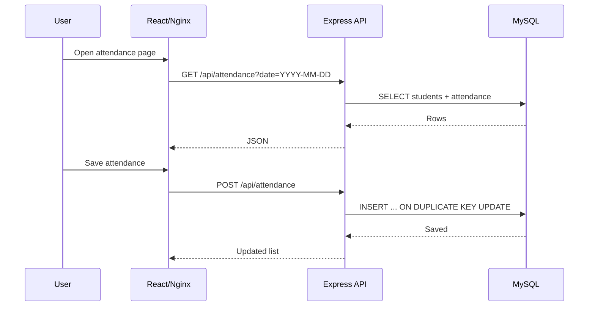

# Architecture

## Runtime Flow

## Business Rules

- Student must exist in `students` before attendance can be saved.
- One student has only one attendance row per day.
- Saving the same student/date updates the existing row.
- Attendance status is limited to `present` and `absent`.
- Statistics count only rows with `status = 'present'`.

## Deployment Units

- Frontend image is built with a multi-stage Dockerfile.
- Backend image installs production dependencies only.
- MySQL data is stored in the `mysql_data` Docker volume.
