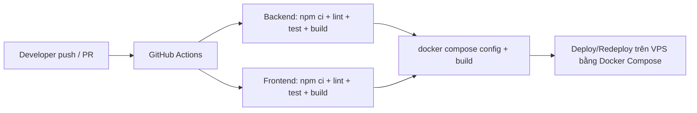

# Hướng dẫn triển khai

## Mục tiêu deploy

Đồ án DevOps không chỉ yêu cầu chạy local, mà cần chứng minh hệ thống có thể chạy trên môi trường production hoặc môi trường tương đương production. Cách triển khai khuyến nghị cho dự án này là Docker Compose trên VPS/WSL Ubuntu.

## Thành phần triển khai

| Service | Image/build | Port |
| --- | --- | --- |
| `frontend` | Build từ `frontend/Dockerfile`, serve bằng Nginx | `${FRONTEND_PORT:-8080}:80` |
| `backend` | Build từ `backend/Dockerfile` | `${BACKEND_PORT:-4000}:4000` |
| `mysql` | `mysql:8.4` | `${MYSQL_PORT:-3307}:3306` |
| `adminer` | `adminer:4` | `8083:8080` |

## Chuẩn bị server

Trên Ubuntu VPS hoặc WSL Ubuntu:

```bash
sudo apt update
sudo apt install -y git ca-certificates curl
```

Cài Docker theo tài liệu chính thức hoặc dùng Docker Desktop nếu chạy WSL. Kiểm tra:

```bash
docker --version
docker compose version
```

## Lấy source code

```bash
git clone https://github.com/dpt004/DevOps.git
cd DevOps
```

Nếu đã clone:

```bash
git pull
```

## Cấu hình ENV

Tạo file `.env` từ mẫu:

```bash
cp .env.example .env
```

Các biến cần sửa khi deploy thật:

| Biến | Ý nghĩa |
| --- | --- |
| `DB_NAME` | Tên database |
| `DB_USER` | User database |
| `DB_PASSWORD` | Mật khẩu database, không dùng giá trị mẫu |
| `MYSQL_ROOT_PASSWORD` | Mật khẩu root MySQL |
| `BACKEND_PORT` | Port public của backend |
| `FRONTEND_PORT` | Port public của frontend |
| `CORS_ORIGIN` | URL frontend production |
| `AUTH_TOKEN_SECRET` | Secret ký token, không dùng giá trị mẫu |
| `SEED_ADMIN_PASSWORD` | Mật khẩu admin seed ban đầu |
| `SEED_TEACHER_PASSWORD` | Mật khẩu giảng viên seed |
| `SEED_STUDENT_PASSWORD` | Mật khẩu sinh viên demo |

Ví dụ khi frontend chạy bằng domain:

```env
CORS_ORIGIN=https://attendance.example.com
```

Lưu ý: không commit `.env`. Chỉ commit `.env.example`.

## Build và chạy hệ thống

```bash
docker compose up -d --build
```

Kiểm tra container:

```bash
docker compose ps
```

Kết quả cần có:

- `mysql` healthy.
- `backend` healthy.
- `frontend` running.
- `adminer` running nếu cần xem database.

## Kiểm tra sau deploy

Backend health:

```bash
curl http://localhost:4000/api/health
```

Frontend:

```bash
curl -I http://localhost:8080
```

Smoke test trên Windows:

```powershell
powershell -ExecutionPolicy Bypass -File .\scripts\smoke-test.ps1
```

Smoke test trên Linux:

```bash
bash scripts/smoke-test.sh
```

## Xem log

Backend:

```bash
docker compose logs backend --tail 100
```

Database:

```bash
docker compose logs mysql --tail 100
```

Frontend/Nginx:

```bash
docker compose logs frontend --tail 100
```

## Redeploy

Khi có code mới:

```bash
git pull
docker compose up -d --build
docker compose ps
```

Nếu chỉ muốn restart:

```bash
docker compose restart backend frontend
```

## Rollback cơ bản

Xem commit gần nhất:

```bash
git log --oneline -5
```

Quay về commit ổn định:

```bash
git checkout <commit_sha>
docker compose up -d --build
```

Sau khi demo rollback, quay lại `main`:

```bash
git checkout main
git pull
docker compose up -d --build
```

## CI/CD flow



Hiện tại repository có CI tự động. Phần CD thực tế được thực hiện bằng thao tác redeploy trên VPS/WSL Ubuntu theo các bước ở trên. Khi demo cần mở GitHub Actions để chứng minh pipeline pass và mở terminal VPS để chứng minh redeploy được.

## Minh chứng cần lưu

- Ảnh GitHub Actions pass.
- Ảnh `docker compose up -d --build`.
- Ảnh `docker compose ps` có backend/mysql healthy.
- Ảnh frontend production mở được.
- Ảnh `/api/health` trả `status: ok`.
- Ảnh `docker compose logs backend --tail 100`.
- Ảnh thao tác redeploy sau `git pull`.
